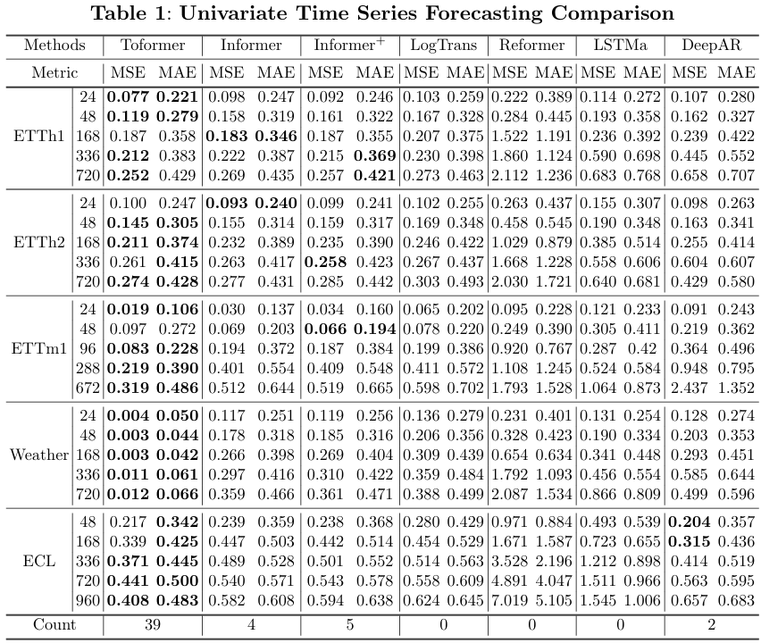
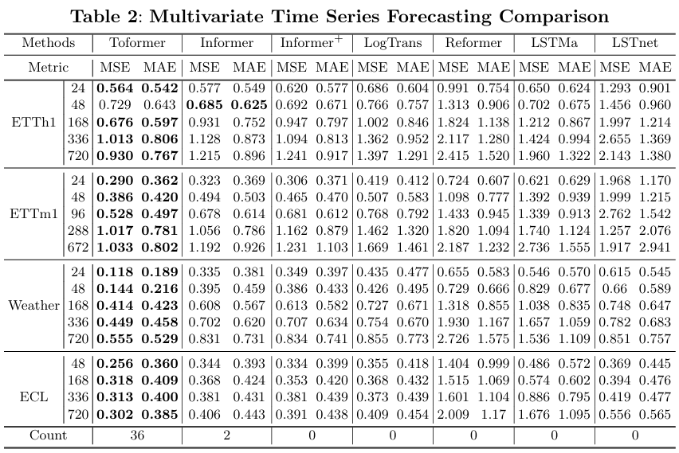

## Toformer：A Multivariate Long-term Time Series Forecasting Model Based on Nonnegative Projection

**Toformer** is an enhanced long-term time series forecasting model based on [Informer2020](https://github.com/zhouhaoyi/Informer2020.git), released under the **Apache License 2.0**. By integrating the **Non-negative Projection Correlation Coefficient (NPCC) Attention** mechanism and a **Convolutional Gating module**, Toformer significantly improves prediction accuracy and stability for complex long-range time series.

---

## Overview

Time series forecasting plays a critical role in energy management, traffic scheduling, and weather prediction. Traditional attention mechanisms often struggle with long sequences and noisy data, leading to decreased accuracy and high computational costs.

Toformer addresses these challenges by:

* Replacing the original KL-divergence based QK correlation with **NPCC Attention**, improving attention weight precision and robustness.
* Incorporating a **Convolutional Gating module** to enhance local temporal feature extraction while complementing global attention.

These enhancements enable Toformer to maintain high accuracy for long-term forecasting while effectively capturing dynamic patterns in complex data.

---

## Key Enhancements

### 1. NPCC-based Attention Mechanism

* Uses **Non-negative Projection Correlation Coefficient (NPCC)** instead of KL-divergence for QK correlation.
* Captures linear relationships between Query and Key vectors more accurately.
* Reduces sensitivity to noise and improves modeling of long-term dependencies.

### 2. Convolutional Gating Module

* Introduces a lightweight convolutional gating mechanism to strengthen temporal feature extraction.
* Filters irrelevant information and highlights critical temporal patterns.
* Complements the attention module to capture both global dependencies and local features efficiently.

---

## Core Features

* **Multivariate Forecasting Support**: Compatible with univariate and multivariate time series.
* **Long-Horizon Prediction**: Optimized for long-term forecasting tasks.
* **Efficient Computation**: Inherits Informer's $O(L \log L)$ complexity, balancing performance and computational cost.
* **PyTorch Compatibility**: Seamlessly integrates with PyTorch ecosystem, supporting GPU acceleration.
* **Flexible Configuration**: Adjustable model and training parameters for different datasets and tasks.

---

## Installation

### Requirements

* Python 3.7+
* PyTorch 1.7+
* NumPy, Pandas, Scikit-learn
* Matplotlib (optional, for visualization)

### Installation Steps

```bash
git clone https://github.com/yongqichang202-beep/Toformer.git
cd Toformer
pip install -r requirements.txt
```

---

## Usage

### Quick Start

1. Prepare CSV-formatted datasets (see `data/` folder for example structure).
2. Configure experiment parameters in `./main_Toformer.py`, including:

   * Dataset path
   * Input/output sequence lengths
   * Model hyperparameters
   * Training parameters (epochs, batch size, learning rate, etc.)
3. Start training:

```bash
python -u main_toformer.py --model toformer --data ECL --attn prob --freq h 
```

---

## Supported Datasets

| Dataset  | Description                                        | Download Link                                                                            | License / Usage                                       |
| -------- | -------------------------------------------------- | ---------------------------------------------------------------------------------------- | ----------------------------------------------------- |
| ETTh1    | Electricity Transformer Temperature 1              | [Kaggle](https://www.kaggle.com/datasets/abiridir/etth1-dataset-csv)                     | Free for research, check for commercial use           |
| ETTh2    | Electricity Transformer Temperature 2              | [Kaggle](https://www.kaggle.com/datasets/labbaxmx/time-series)                           | Free for research                                     |
| ETTm1    | Electricity Transformer Temperature multivariate 1 | [Kaggle](https://www.kaggle.com/datasets/labbaxmx/time-series)                           | Free for research                                     |
| ECL      | Electricity Consumption                            | [Nixtla](https://nixtlaverse.nixtla.io/datasetsforecast/long_horizon.html)               | Open-source, free for research                        |
| Traffic  | Traffic Flow                                       | [Nixtla](https://nixtlaverse.nixtla.io/datasetsforecast/long_horizon.html)               | Open-source, free for research                        |
| Weather  | Weather Forecast                                   | [Nixtla](https://nixtlaverse.nixtla.io/datasetsforecast/long_horizon.html)               | Open-source, free for research                        |
---

## Experimental Results

In multiple long-horizon forecasting benchmarks, **Toformer** outperforms baseline models including Informer:

* Lower MAE (Mean Absolute Error) and RMSE (Root Mean Squared Error)
* Improved stability across different prediction horizons
* Stronger generalization to noisy or irregular time series

The following primarily presents relevant metrics under univariate and multivariate tasks. 



---

## License

This project is released under the **Apache License 2.0**. See [LICENSE](./LICENSE) for details.

---

## Acknowledgements

* We sincerely thank **Zhou et al.** for their [Informer2020](https://github.com/zhouhaoyi/Informer2020), which serves as the foundational framework for this extended and enhanced project.  
* Thanks to the **PyTorch community** for ecosystem support.  


---

## Contact

For technical inquiries or collaboration:

* Author: \[[yongqichang202@gmail.com](yongqichang202@gmail.com)]
* Project: [[https://github.com/yongqichang202-beep/Toformer.git](https://github.com/yongqichang202-beep/Toformer.git)]

